# .NET JIT脱壳指南与工具源码

## 前言

JIT脱壳可能对很多人来说是很难的，因为网上没有特别多的介绍，有的工具源码也仅限于yck1509（ConfuserEx作者）的jitDumper3和基于这个工具的CodeCracker修改的ManagedJiter和DNGuard_HVM_Unpacker，然后还有CodeCracker自己写的Simple_MSIL_Decryptor（很不稳定）。

要研究JIT脱壳需要先了解clr源码。对于.NET 2.0~3.5可以看IDA反编译mscorwks.dll和mscorjit.dll或者是看SSCLI的源码，对于.NET 4.0+可以看coreclr的源码。如果我没记错，coreclr是.NET 4.6分支出来的。

.NET可以说有3个大版本，分别是.NET 2.0 .NET 4.0 .NET 4.5，这3个版本的clr有很大变化。.NET 2.0的clr名称是mscorwks.dll，jit名称是mscorjit.dll。.NET 4.0的clr名称变成了clr.dll，jit名称变成了clrjit.dll，还有少量的clr和jit内部结构体的变化。.NET 4.5的clr名称和jit名称与.NET 4.0的相同，但是内部结构体有巨大变化，最明显的是clr提供给jit编译所需信息的接口ICorJitInfo的虚表结构和函数的定义，与.NET 4.0的完全不一样。所以CodeCracker发布的几个工具要用NetBox或者虚拟机安装.NET 4.0来运行，CodeCracker的那几个工具不支持.NET 4.5+。

**本文要介绍的内容在.NET 2.0~4.72都是正确的，最新出的.NET 4.8有些变化，但是我没去看有什么变化，所以本文不讨论.NET 4.8。**我的工具运行不了，我也懒得去修改我的工具了。源码在文章后半部分会贴出，好早之前就上传到github了，一直没写使用说明。

## CLR与JIT简介

这个部分我推荐看coreclr的文档 [Book of the Runtime](https://github.com/dotnet/coreclr/blob/master/Documentation/botr/README.md) ，非常不错的资料，对CLR任何版本都是适用的，我就没必要重复啰嗦一遍了。

## JIT编译流程

这个东西应该是非常重要的，必须要了解的，不然文章很多地方会看不懂，那些脱壳机的源码也会看不懂。这里依然推荐看coreclr的文档，[RyuJIT Ooverview](https://github.com/dotnet/coreclr/blob/master/Documentation/botr/ryujit-overview.md) 虽然RyuJIT是.NET 4.5还是.NET 4.6才有的，但是老版本的JIT的编译流程还是几乎相同的。

[Phases of RyuJIT](https://github.com/dotnet/coreclr/blob/master/Documentation/botr/ryujit-overview.md#phases-of-ryujit) 看不懂可以直接机翻，虽然有好多流程，但是实际上要了解的只有 Pre-import 和 Importation 这2个阶段，这2个阶段还会调用ICorJitInfo接口，我们要研究的就是这个接口。

### 从DoPrestub到compileMethod

现在我们可以打开coreclr源码，找到 MethodDesc::DoPrestub 。CLR会为每个方法生成一个stub，stub最终都会跳转到MethodDesc::DoPrestub，由MethodDesc::DoPrestub调用JIT编译器。在编译之前，MethodDesc::DoPrestub会进行参数检查，并且判断方法类型，其中包括泛型方法的泛型参数检测。

最终，DoPrestub会转到jit的导出函数compileMethod，在coreclr里面也找得到对应的代码 CILJit::compileMethod

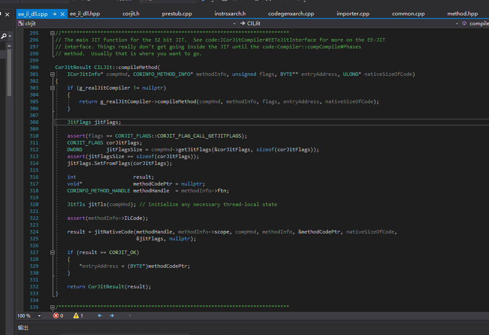

可以说所有的壳，都是通过Hook ICorJitCompiler虚表来进行jit解密的，没有例外。

可能有人会问为什么不Hook更底层的函数，比如jitNativeCode，Compiler::compCompile等等，原因还是很简单，Inline Hook这些函数很麻烦。寻找这些函数的地址还要通过特征匹配，如果JIT有点变动，特征就变了，就会出现匹配失败，这也是CodeCracker的脱壳机不能在.NET 4.5+运行的原因之一。

可能还有人会问Hook这么浅层的导出函数，会不会出现不安全的情况，答案是不会的，因为有些壳同时自己实现了ICorJitInfo接口，在ICorJitInfo接口内进行解密操作。直接dump到的IL是对的，但是IL中的token会是加密的。所以脱壳机Hook更底层的Compiler::compCompile和网上说的Hook更底层的函数来解密是没有什么依据的，Hook哪一层函数都是一样的，dump到的IL不会变，token永远是加密的，解密操作还在更底层进行，并且解密之后不会还原到IL里面！！！

CILJit::compileMethod不会执行实际的编译，它会调用jitNativeCode，由jitNativeCode实例化Compiler类。实际上jitNativeCode也是一个包装，负责调用Compiler::compCompile。

### JIT内部

先贴张JIT流程图，看不懂的可以对着这个看看。

Compiler::compCompile有2个重载方法，我们从最表层的说起。

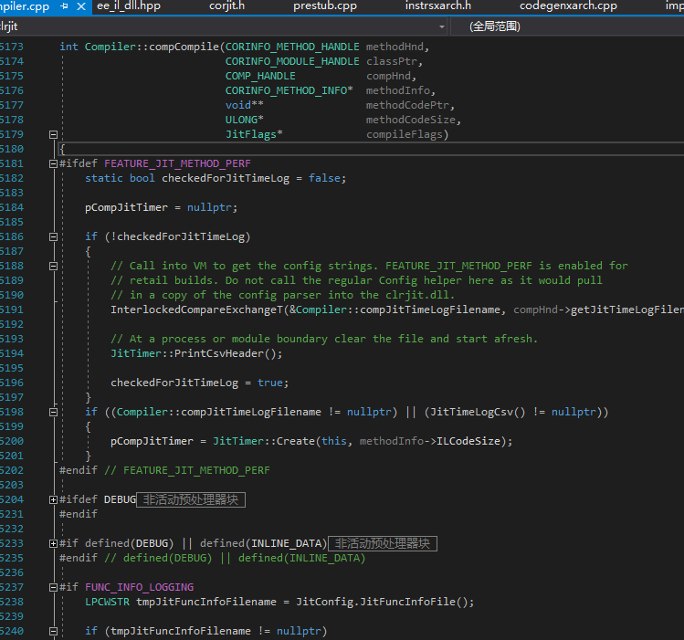

这个是jitNativeCode会调用的。CodeCracker的那个脱壳机通过hook jitNativeCode中call Compiler::compCompile来达到hook Compiler::compCompile的效果，在这里进行dump IL。

这个Compiler::compCompile依然是个包装，没有实际执行的部分。

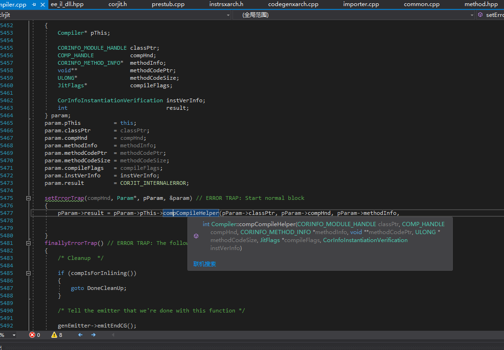

接下来是这个函数调用的Compiler::compCompileHelper，这个函数会初始化一些信息，EHcount是异常处理子句数量，maxStack是栈元素最大数量。

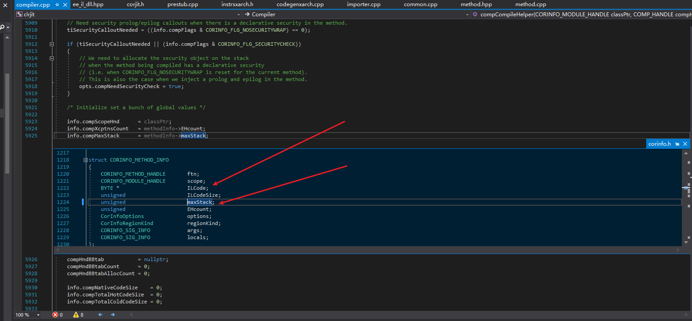

接下来是局部变量表初始化。

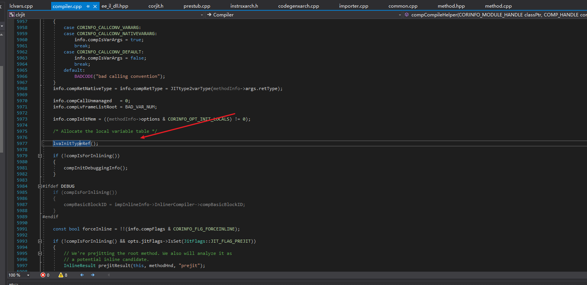

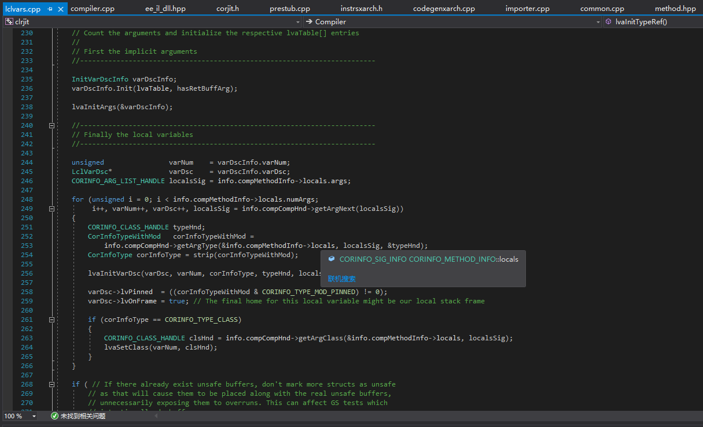

这个locals是局部变量信息，对应的结构体是CORINFO_SIG_INFO。

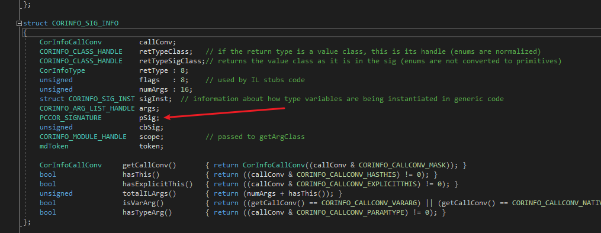

其中的字段pSig指向了#Blob堆中的LocalSig。脱壳机可以通过这个来dump局部变量签名。当然，壳也可以直接抹掉这个LocalSig，通过ICorJitInfo这个接口来给jit提供局部变量信息，因为jit也是使用ICorJitInfo这个接口来获取局部变量信息，而不是直接解析CORINFO_SIG_INFO.pSig。所以一些情况下dump pSig得到的局部变量签名是无效的，要如何解密或者dump，这个大家自己研究了，我就不透露那么多了。

现在我们回到Compiler::compCompileHelper，继续探究编译流程。我们可以看到调用了fgFindBasicBlocks这个函数

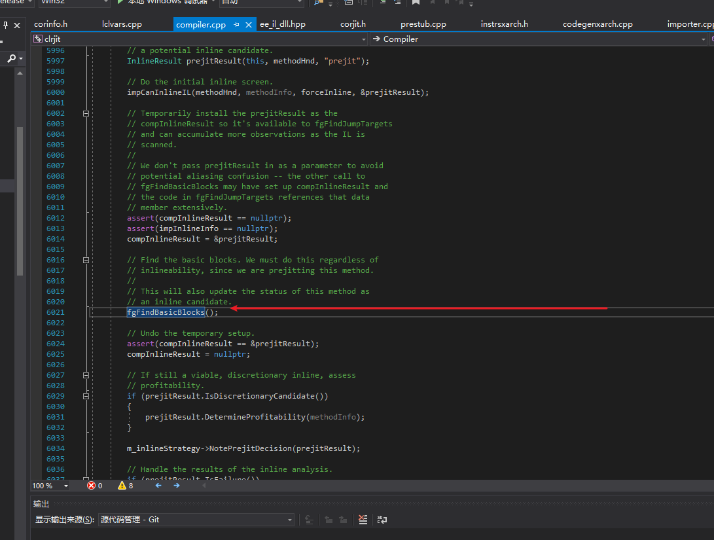

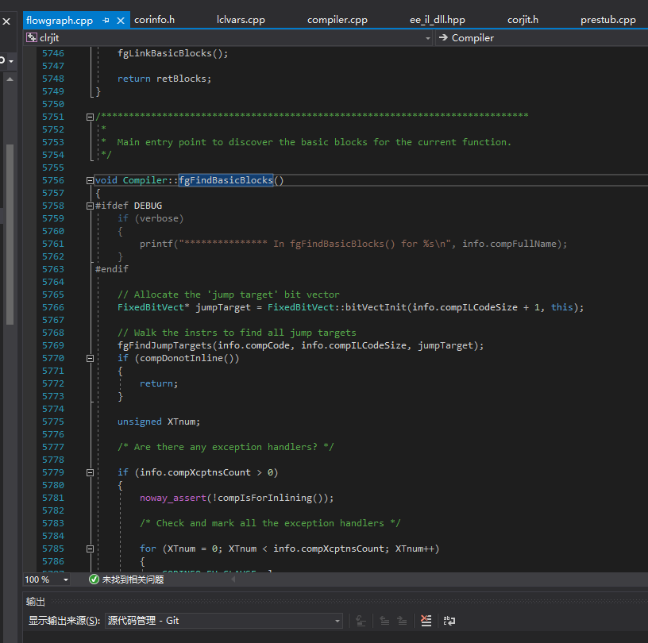

fgFindBasicBlocks是生成基本块的入口函数，和我那个控制流分析类库一样，要生成基本块才能继续分析。这个函数会调用ICorJitInfo::getEHinfo来获取异常处理子句的信息。

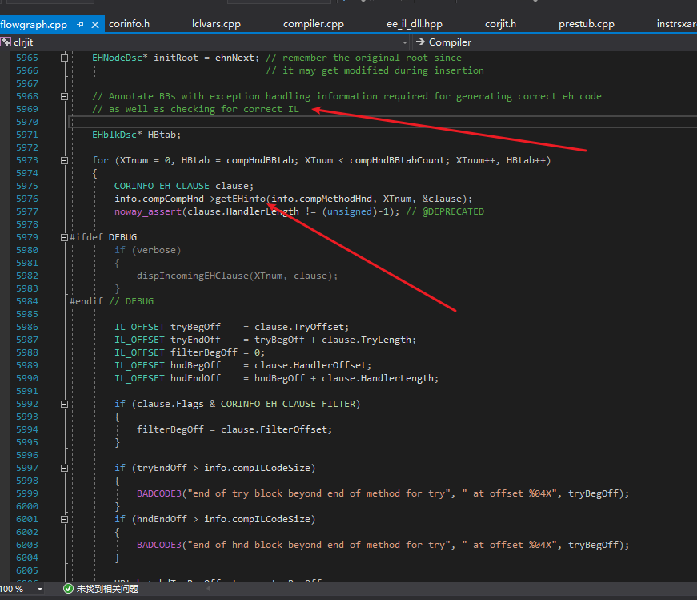

这个CORINFO_EH_CLAUSE结构体也是我们脱壳需要的。

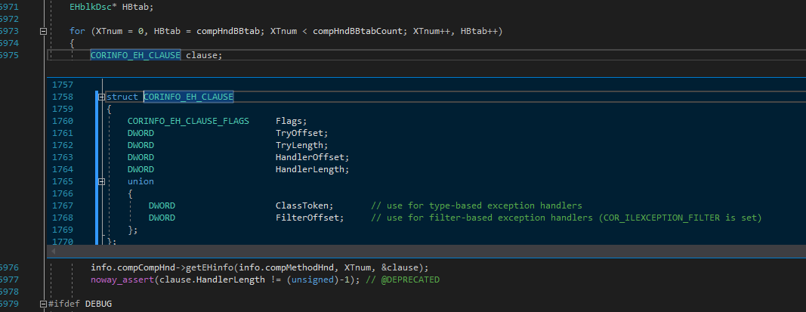

现在，我们获取了解密方法体需要的3大信息，IL代码，局部变量，异常处理子句。但是还记得我在前面说过IL指令中如果操作数是token，token是加密的吗？是的，所以我们要继续深入JIT。

我们应该来到importer.cpp，这里JIT会通过ICorJitInfo把IL指令转化为GenTree，其中token需要转化为JIT内部定义，所以token是不会被还原到IL代码里的，需要自写代码解密并还原。

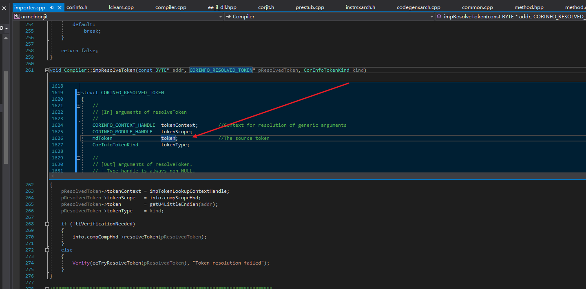

这个是.NET 4.5+的token相关函数，.NET 4.5+引入了CORINFO_RESOLVED_TOKEN这个结构体，coreclr也用的这个结构体，里面的token就是IL指令中操作数的token，在.NET 2.0~3.5 .NET 4.0的时候还有个embedGenericHandle用来获取token。这个函数是CodeCracker的脱壳机用来解密token的。

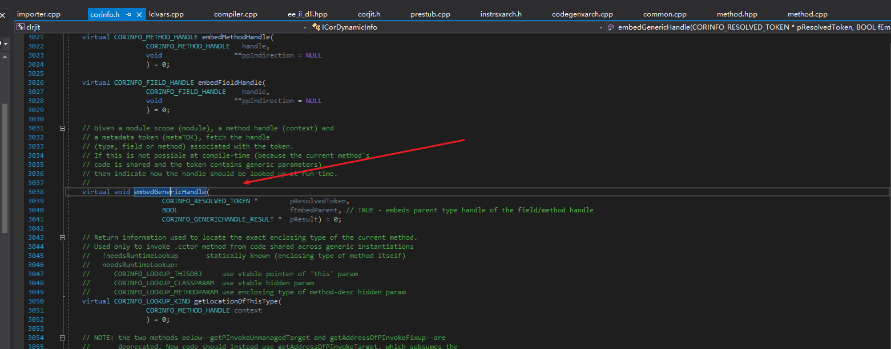

整个JIT编译流程，我们就算了解完毕了。

## JitUnpacker

这个是我和画眉一起写的一个脱壳机，去年9月份左右开写的，现在已经开源了整个框架，去掉了脱DNG和其它一些壳的代码，只留下了通用的脱壳部分。所以叫JitUnpacker-Framework更合适，GitHub：[JitUnpacker-Framework](https://github.com/wwh1004/JitUnpacker-Framework) 一次性开源后我不会继续维护这个仓库，仅供研究使用，注意！！！

如果要研究JIT脱壳，我还是非常推荐先看我的这个开源版本JitUnpacker的代码，这个JitUnpacker支持.NET 2.0~3.5 .NET 4.0~4.72（不支持.NET 4.8，我没安装.NET 4.8，所以没做支持）。而且结构体定义全部是正确的，关键地方的注释都有。CodeCracker的那个脱壳机代码太乱了，而且对泛型支持，值类型支持不太好，最关键的是结构体定义是错的，部分代码也是错的，会误导人。

### 简介

整个脱壳机有2大部分。

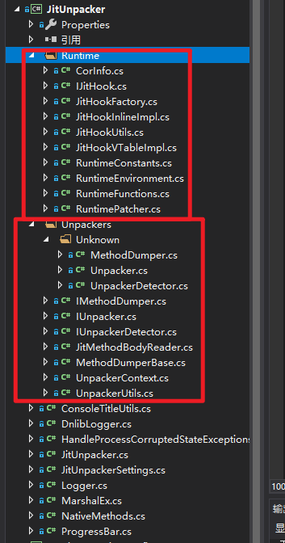

第一个是文件夹Runtime里面的内容，第二个是Unpackers文件夹里面的内容。

Runtime提供了运行时相关信息，比如DoPrestub的包装，JitHook的接口之类的。

Unpackers是脱壳逻辑的代码，实现IMethodDumper IUnpacker IUnpackerDetector这三个接口就可以了。Unknown文件夹是和de4dot参数-p un类似的东西，可以处理没反脱壳的壳。

### Runtime

这个是CORINFO_METHOD_INFO的包装，因为CORINFO_METHOD_INFO结构体在.NET 2.0和.NET 4.0+有区别，所以有个包装。

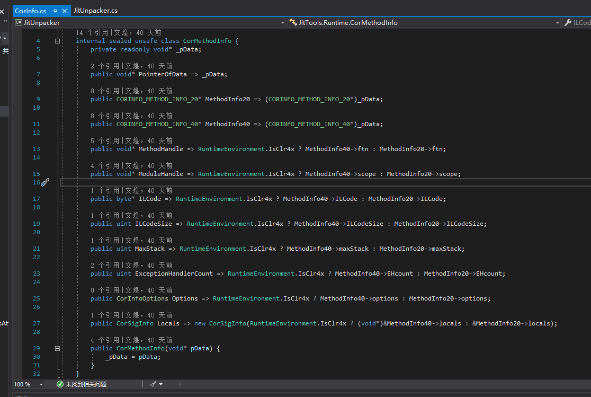

这个是JitHook的接口，实现这个接口，为IMethodDumper提供所需信息即可。目前已经内置了CodeCracker脱壳机的hook方式（准确的说式yck1509的，CodeCracker只是做了些修改）和compileMethod虚表hook方式。

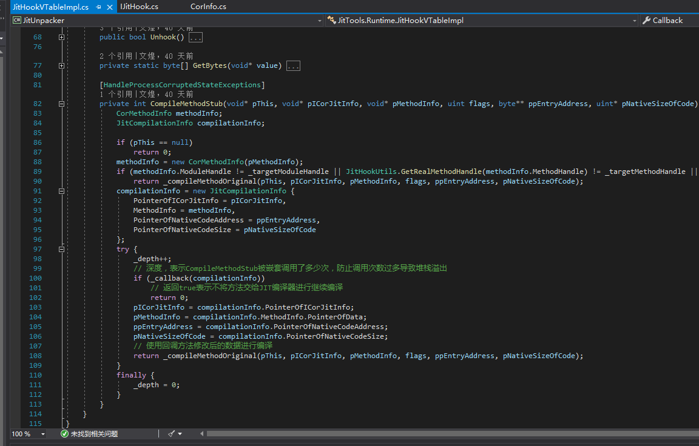

由于值类型的存在，所以有了UnboxingStub，对比方法句柄的时候，我们不能直接对比，需要这样。

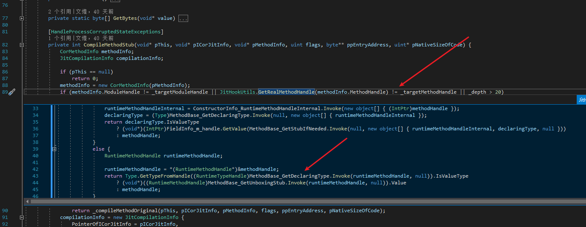

接下来是RuntimePatcher，首先要patch的是canInline，如果不patch这里，让一些方法被内联编译，脱壳会出错。然后还有类静态构造器的检测，编译方法的时候DoPrestub会检查类静态构造器有没有运行过，如果没运行，CLR会先运行类静态构造器，导致运行我们脱壳机之外的代码。最后一个patch的地方是泛型检测，DoPrestub会检测泛型参数，如果没有泛型参数，会禁止编译。

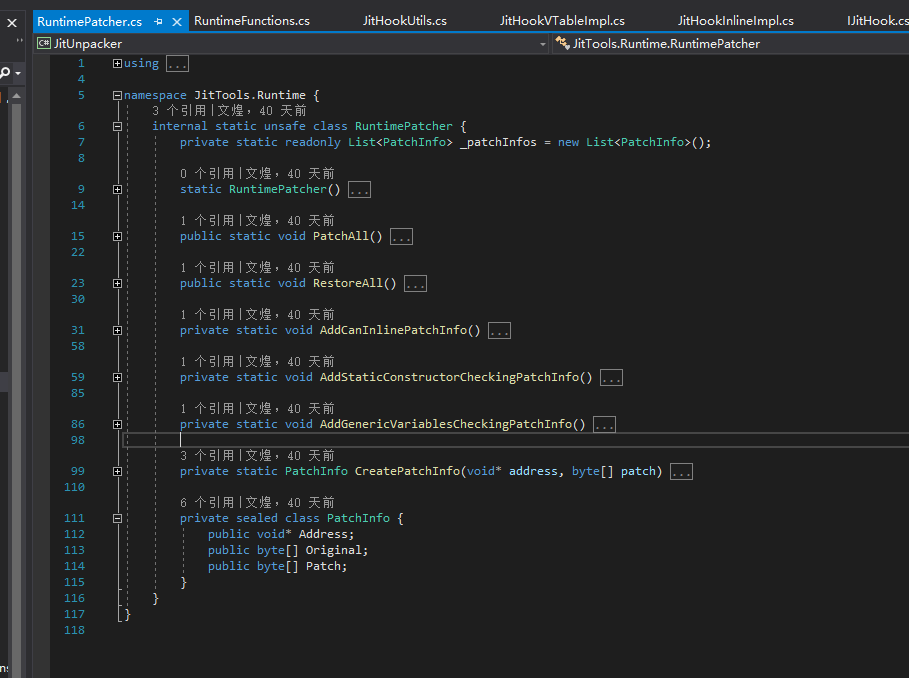

类静态构造器运行检测的代码没在coreclr里面找到，就不贴了。下面是泛型参数检测。

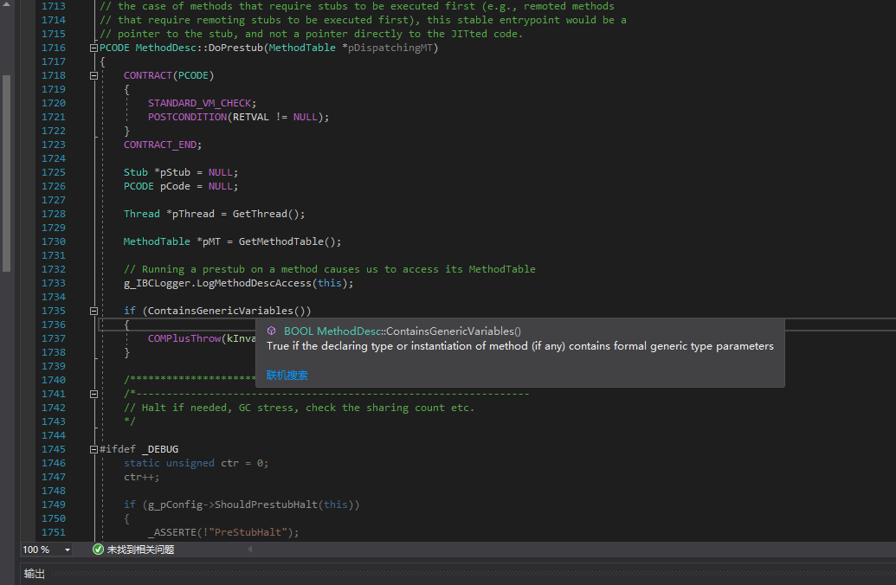

### 其它

这里就是些杂七杂八的东西了。首先要提一下的是LoadMethodHandles，CodeCracker的代码里面会特别处理泛型，但是那个是错的。

我直接调用ResolveMethodHandle。

CodeCracker打算实例化泛型方法，但是其实这是没用的，我特意去看了coreclr源码，也做过测试，这样得到的方法句柄是和直接调用ResolveMethodHandle得到的一样的。

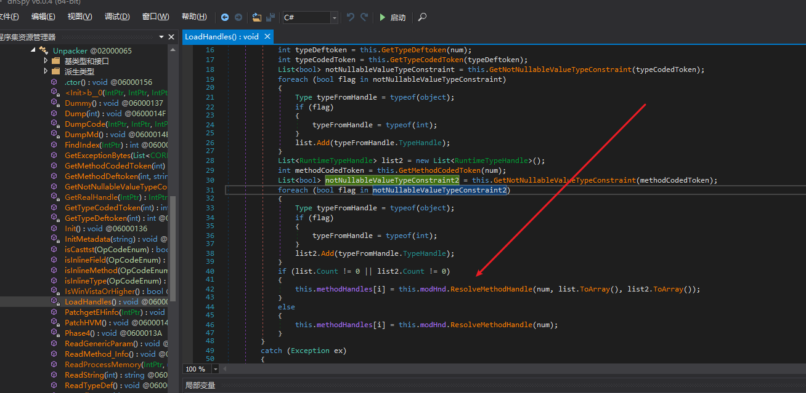

第二个要提的是CLR内部的UnboxingStub，在处理值类型的方法的时候，CLR会生成这个，如果直接DoPrestub，CLR是不会让JIT编译这个方法的，要调用GetWrappedMethodDesc，用这个返回值给DoPrestub才能触发JIT。

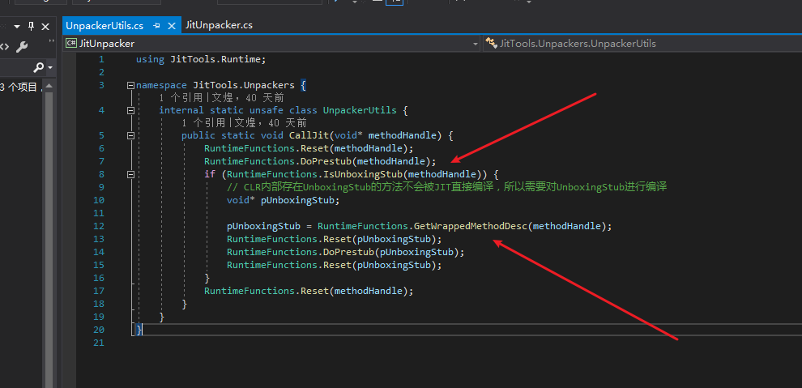

CodeCracker的处理方法是直接Invoke，然后在hook到的compCompile里面直接写入0xC3，也就是ret指令。

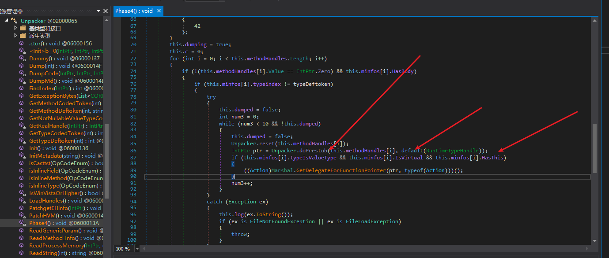

这样JIT脱壳就大体介绍完成了。

### 使用方法

从 https://github.com/wwh1004/JitUnpacker-Framework clone我的代码到本地，注意把子模块一起clone。然后编译，生成文件。你会看到一个.bat文件

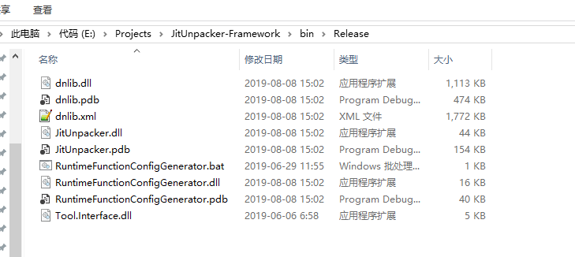

然后下载我的ToolLoader https://github.com/wwh1004/ToolLoader 这个里面有编译好的，下载之后只需要把这5个文件复制出来。

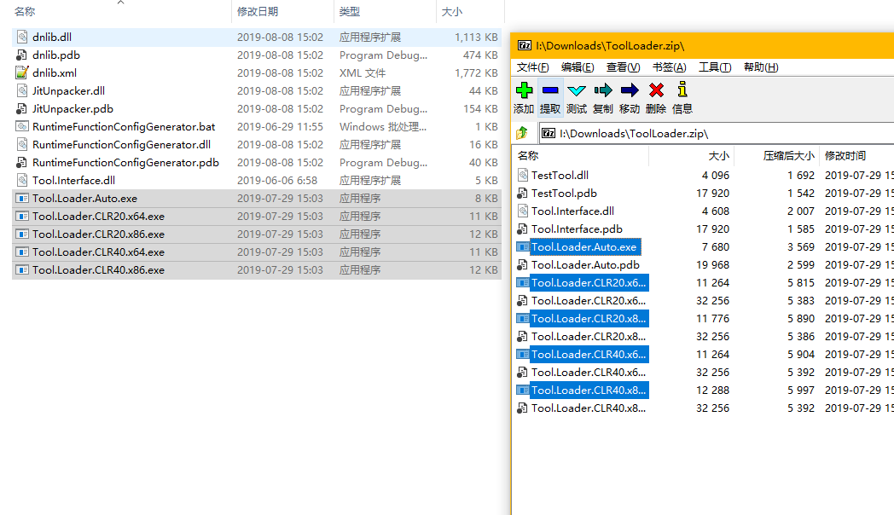

现在，你需要下载好mscorwks.dll mscorjit.dll clr.dll clrjit.dll的符号文件，怎么下载别问我了，x64dbg windbg都可以下载，然后修改这里的YOUR_SYMBOLS_PATH

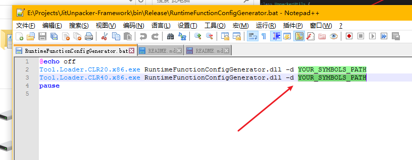

比如我的是E:\Symbols，那就改成这样，然后保存。

运行RuntimeFunctionConfigGenerator.bat，会生成"JitUnpacker.RuntimeFunctions.CLR20.x86.config"和"JitUnpacker.RuntimeFunctions.CLR40.x86.config"这2个配置文件。

把要脱壳的文件，包括相关的dll一起复制到JitUnpacker.dll所在目录，shift+右键点击文件夹，选择在此处打开命令行窗口。

可以先看看JitUnpacker参数

-f 指定要脱壳的文件的路径

-hook-type 指定jithook的类型，这个翻源码找得到有什么类型，默认用inlinehook

其它的参数自己看得懂了。

找个CodeCracker的工具做示范，比如SimpleByteArrayInit.exe，用dnSpy可以知道这个是.NET 2.0 x86的

然后命令行里面输入"Tool.Loader.CLR20.x86.exe JitUnpacker.dll -f SimpleByteArrayInit.exe"，回车即可。

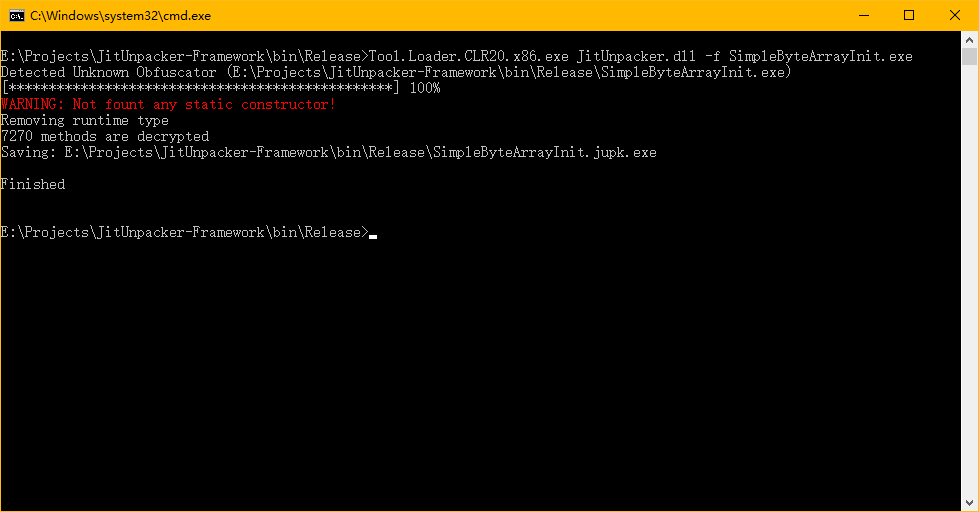

## 写在最后

**我不接单，不要私信找我，也不要通过各种聊天方式加我好友！！！**

**DNG等壳脱壳代码不会出现在开源版本的JitUnpacker-Framework中，也不要问我私有版本的JitUnpacker的代码，这些不会放出的！！！**

**如果看不懂文章，或者不会使用文章给出的工具，可以自己多研究研究，这个我不会回复。当初一点资料都没，CodeCracker的源码还一堆错误的时候，还是和画眉一点一点研究，写出了这个脱壳机。**

**如果脱壳机有BUG，或者不能在某个.NET版本上工作，尝试其它.NET版本，我不会继续更新这个开源版本的JitUnpacker-Framework，这个仓库仅供研究使用！！！**
