# [.NET]详解ILProtector并写出脱壳机 by Wwh / NCK

## 前言

ILProtector应该算是一款强度不是太高，兼容性还不错的壳，网上有关这个壳的资料几乎没有。但是有CodeCracker大神放出的脱壳机和一些基于他的脱壳机改进得到的脱壳机。

这些脱壳在最新版本的ILProtector上已经失效了，但是原理并没有失效。许多人只是使用这些脱壳机，是并不知道其中的原理。这些脱壳机一失效，便无法脱壳。

本文将详解ILProtector的加壳原理并基于GitHub上开源的一个项目（[ILProtectorUnpacker  by RexProg](https://github.com/RexProg/ILProtectorUnpacker)）写出属于自己的脱壳机。

在研究之前，我们还是需要找到一个ILProtector加壳的样本。很遗憾，没在网上找到最新ILProtector加壳的UnpackMe，所以我们直接拿ILProtector主程序开刀（官网上写了"ILProtector is protected by itself!"）。

在研究的时候，用的是2.0.22.4版本的ILProtector，但是写文章的时候发现ILProtector更新到了2.0.22.5，有点尴尬。但是我测试过了，2.0.22.5和2.0.22.4并没有区别，所以本文还是以ILProtector v2.0.22.4主程序为样本来研究。这里提供打包好的文件下载：[ILProtector v2.0.22.4.7z](https://github.com/wwh1004/blog/raw/master/%5B.NET%5D%E8%AF%A6%E8%A7%A3ILProtector%E5%B9%B6%E5%86%99%E5%87%BA%E8%84%B1%E5%A3%B3%E6%9C%BA/ILProtector%20v2.0.22.4.7z)

## ILProtector保护方式概览

我们先用dnSpy打开ILProtector看看这究竟是怎样保护的：

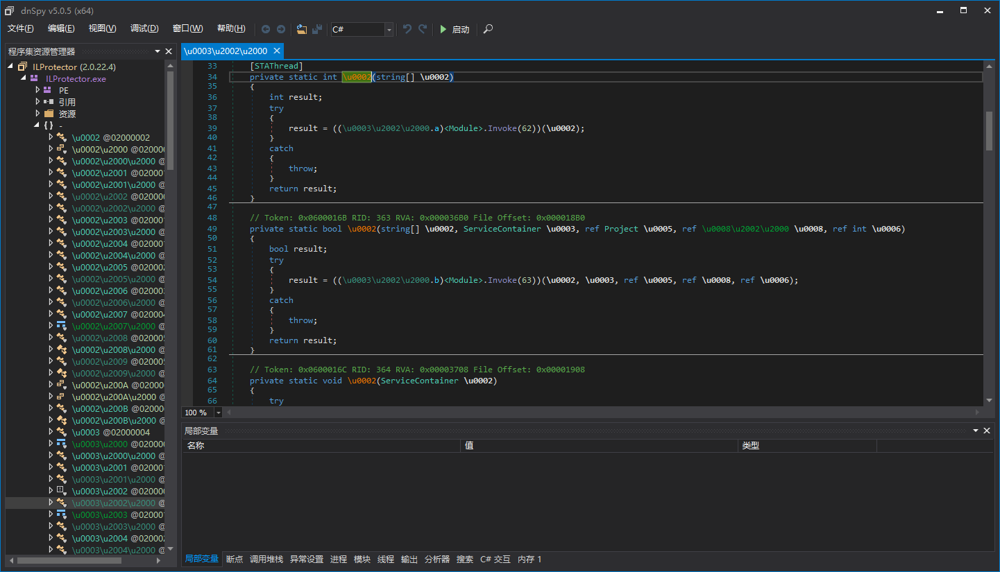

我们可以看到方法体被隐藏了，全部被替换成了"&ltModule&gt.Invoke(num)"。尝试用dnSpy调试：

先在Main方法这里下断点：


断下来后按F11单步：

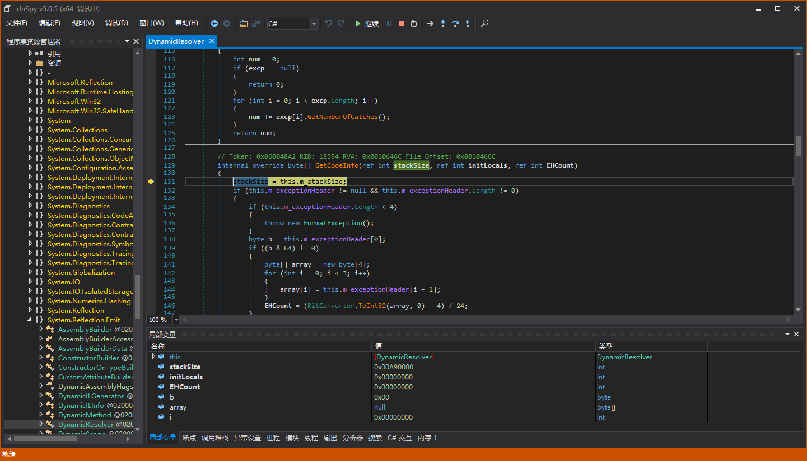

可以初步判断出应该是用了DynamicMethod，我们在DynamicMethod的构造器处下断点，并按F5运行：


没错，我们的猜错是对的，ILProtector用了DynamicMethod动态生成一个方法体来保护程序集的。

## ILProtectorUnpacker by RexProg的脱壳原理

### 脱壳流程

为了避免各种没有特别大意义的尝试，我们来看看文章开头提到的那个开源项目是怎么实现脱壳的。我们先在vs里面打开这个项目。（这个提供打包好的项目下载：[ILProtectorUnpacker by RexProg.7z](https://github.com/wwh1004/blog/blob/master/%5B.NET%5D%E8%AF%A6%E8%A7%A3ILProtector%E5%B9%B6%E5%86%99%E5%87%BA%E8%84%B1%E5%A3%B3%E6%9C%BA/ILProtectorUnpacker%20by%20RexProg.7z?raw=true)）

找到Main方法，看看是怎么一回事（下面的注释都是我自己加的）：

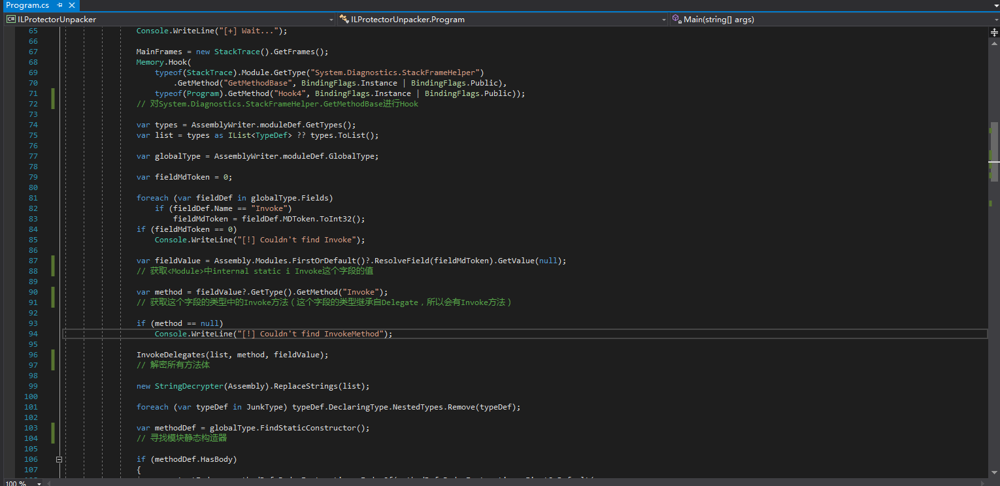

可以发现真正的实现是在InvokeDelegates中，转到这个方法：

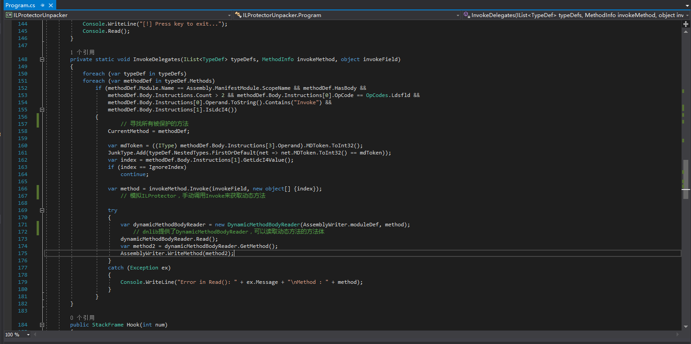

### 过检测

此刻我们大概搞懂脱壳机的脱壳流程了。脱壳机先加载被保护的程序集，接着对一个地方进行Hook，然后手动调用Invoke来获取动态方法，再使用dnlib提供的DynamicMethodBodyReader读取这个动态方法的方法体，还原到文件中的方法体中。刚才提到了Hook，既然是Hook，那八九不离十的与过检测有关，我们来看看Hook了什么玩意：

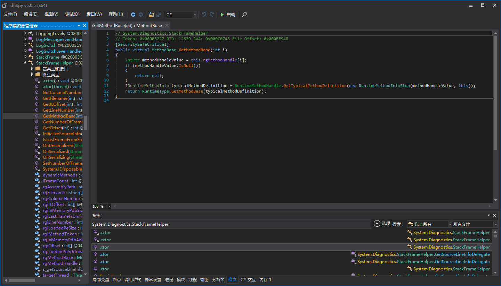

对应的Detour：

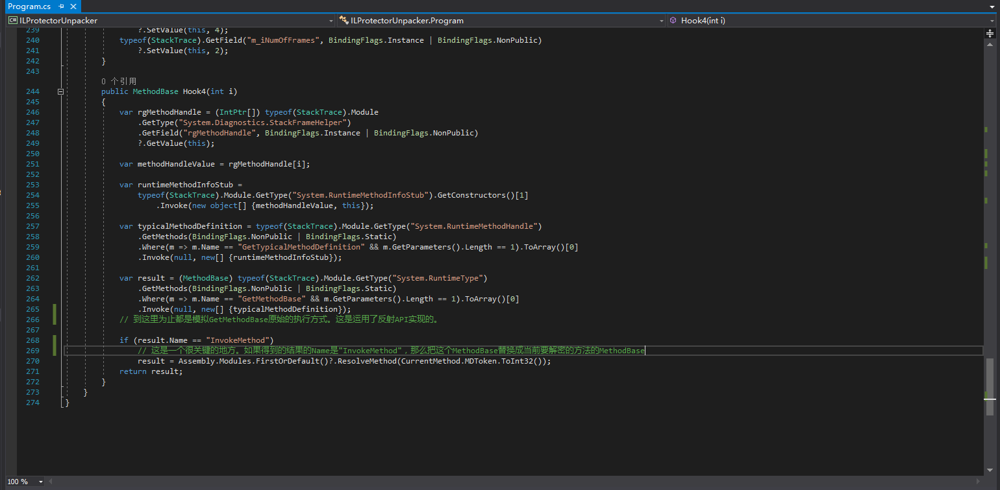

到这里我们不是特别明白为什么要Hook System.Diagnostics.StackFrameHelper.GetMethodBase，也不明白"if (result.Name == "InvokeMethod")"中的InvokeMethod是何方神圣，我们再次用dnSpy搜索并反编译InvokeMethod看看：

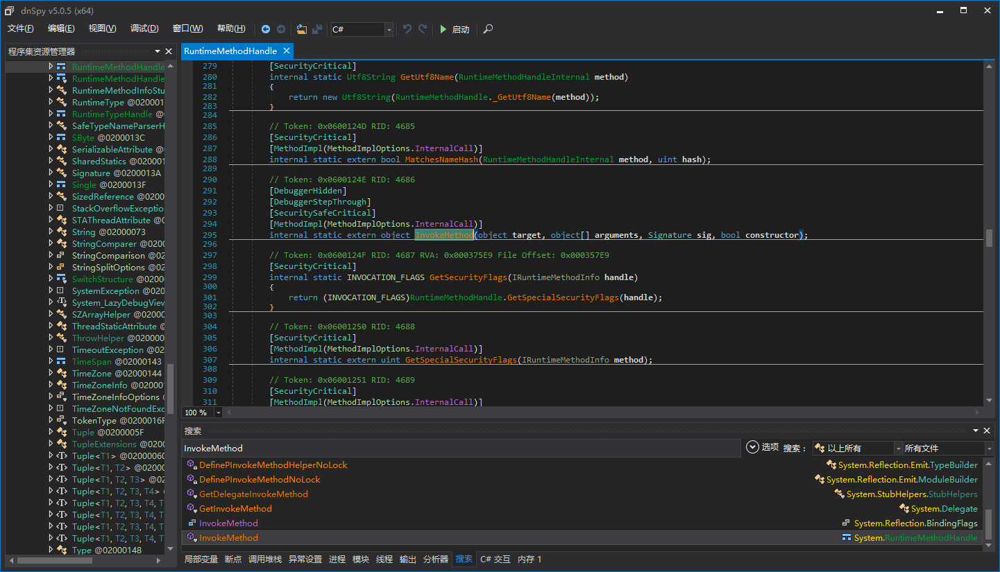

如果有点逆向经验的，应该会知道这个是调用MethodInfo.Invoke时，在托管代码中进入CLR的地方，可以理解成Win32编程中R3转到R0的地方。


再结合一些反非法调用的检测原理，可以知道，ILProtector会检测调用堆栈中，被保护方法的上一个方法，比如这样：

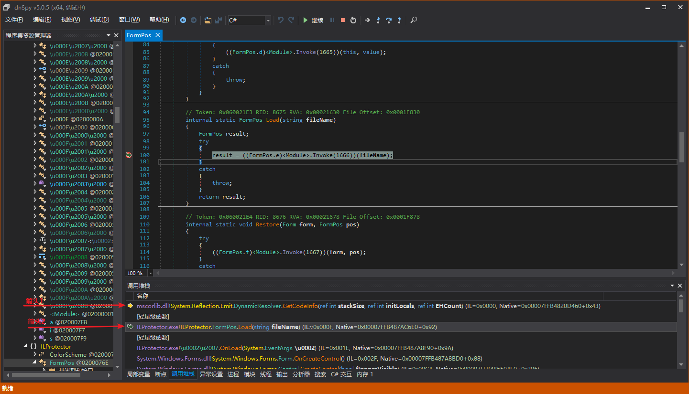

假设箭头2指向的是被保护的方法，箭头1指向的是与ILProtector运行时的非托管代码（当成是，因为dnSpy没法单步进入非托管代码），那么运行时的非托管代码会检测箭头2指向的调用者（Caller）是不是被保护的方法，即这里的"internal static FormPos Load(string fileName)"。如果我们手动Invoke来获取动态方法，那么非托管代码检测到的就不会是"internal static FormPos Load(string fileName)"了，而是刚才提到的"System.RuntimeMethodHandle.InvokeMethod"，所以RegProg的脱壳机Hook了GetMethodBase，并且写了
``` csharp
if (result.Name == "InvokeMethod")
    // 这是一个很关键的地方。如果得到的结果的Name是"InvokeMethod"，那么把这个MethodBase替换成当前要解密的方法的MethodBase
    result = Assembly.Modules.FirstOrDefault()?.ResolveMethod(CurrentMethod.MDToken.ToInt32());
```
来过检测。

这段解释有点难理解，虽然尽可能的详细解释了。读者可能会看不太明白，但是知道个大概，所以还是需要自己调试跟踪看看，实践才能真正学习到知识！

### 出错了！

看着我写的，是不是觉得ILProtectorUnpacker写得非常完美？但是道高一尺魔高一丈，有了过检测，也会有反过检测。我们直接编译RexProg的脱壳机并运行：

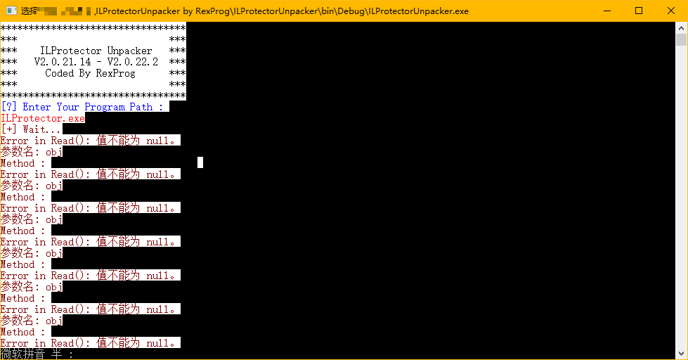
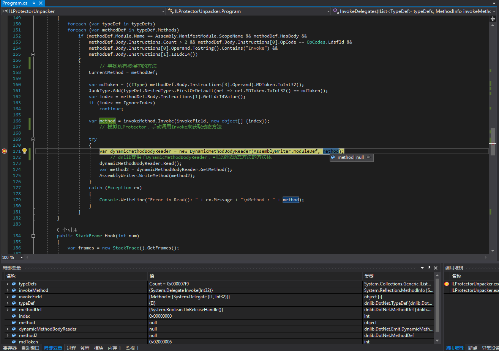

为什么会这样呢，经过各种分析和尝试，也为了文章更简洁，这里将直接写上正确的分析反过检测过程（ILProtector检测到了我们手动调用Invoke）

## ILProtector的检测

首先，ILProtector会检测调用堆栈，我们进行处理了，并且正常工作，那么为什么还会被ILProtector检测到非法调用呢？答：ILProtector检测到了我们的Hook。

先修改一下Memory.Hook，让它输出一些信息（Hook中Target的地址和Detour的地址）：

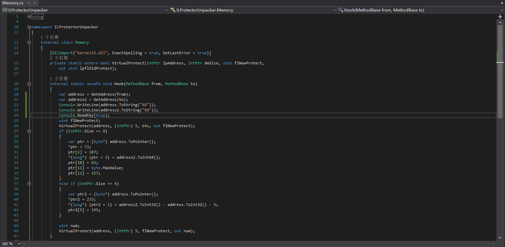

打开x64dbg，启动脱壳机，并让脱壳机运行，到"Console.ReadKey(true);"处停下就行：

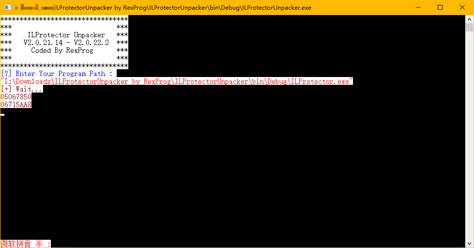

到x64dbg的内存窗口中转到第一个地址，第一个地址是被Hook的方法的地址，即System.Diagnostics.StackFrameHelper.GetMethodBase的地址，然后给System.Diagnostics.StackFrameHelper.GetMethodBase下硬件访问断点：

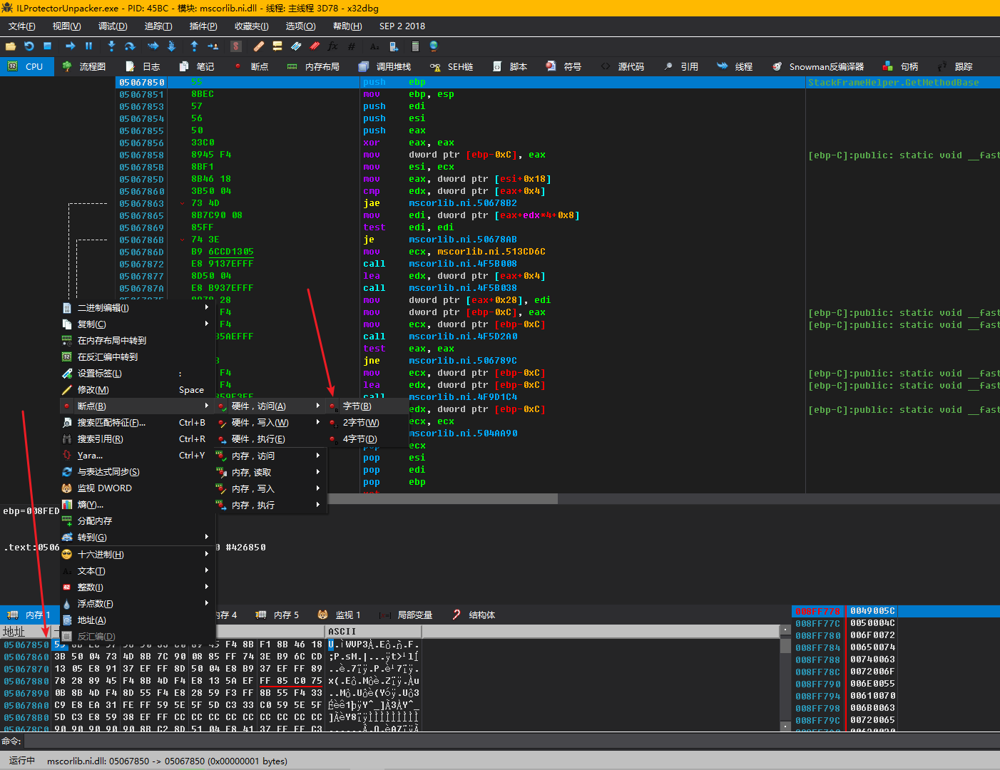

控制台里面随便按一个按键，让脱壳机继续执行，直到断在了ProtectXXX.dll。

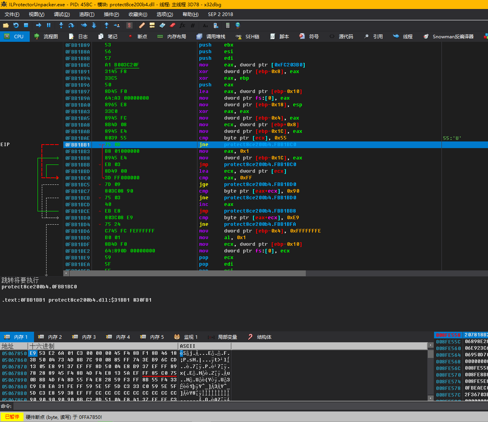

这里是一个jcc指令，更能证明这里是检测是否被Hook。为了方便，而且这是个未加壳的DLL，我们直接上IDA，反编译这个Hook检测函数。这个函数的RVA是0x31B70，所以直接在IDA中搜索"31B70"。

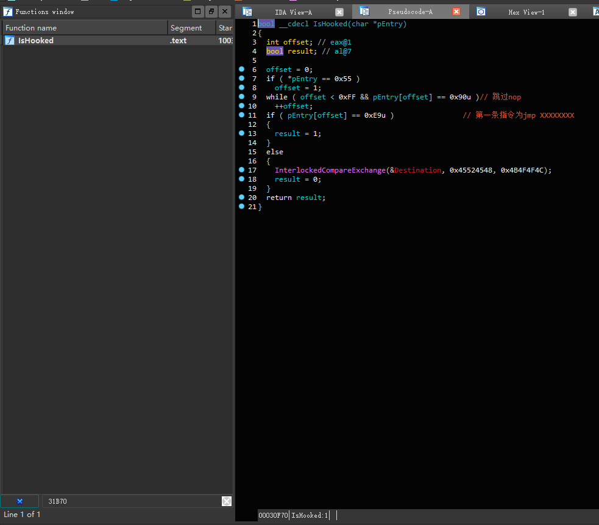

我已经把代码重命名好了，所以读者可以直接思考这段检测的原理。我还是大概解释一下这个检测：

IsHooked(char *pEntry)会被传入要检测的地址，比如这次用x64dbg调试，被传入的地址就是0x05067850。

``` cpp
if ( *pEntry == 0x55 )
  offset = 1;
```

这段代码可以认为是垃圾代码，不需要理解

``` cpp
while ( offset < 0xFF && pEntry[offset] == 0x90u )// 跳过nop
  ++offset;
```

跳过nop

``` cpp
if ( pEntry[offset] == 0xE9u )                // 第一条指令为jmp XXXXXXXX
{
  result = 1;
}
else
{
  InterlockedCompareExchange(&Destination, 0x45524548, 0x4B4F4F4C);
  result = 0;
}
return result;
```

判断nop后（如果存在nop）的第一条指令是不是jmp。如果是jmp，返回true，表示检测到了Hook；如果不是jmp，表示代码正常，未被Hook，设置一个标志后（这个标志不用管），返回false。

## 再过ILProtector检测

可是别忘了我们有无数方式来写点JunkCode，直接就过掉了检测。

我们先看看脱壳机把System.Diagnostics.StackFrameHelper.GetMethodBase改成什么样了：


难怪会被检测到，这第一条指令就是jmp，Hook得太直接了。我们玩点花样，在"jmp 0x06715AA8"前面加个0xEB 0x00，相当于"jmp eip/rip+2"。


按F8单步到Hook检测返回，可以发现，它返回false了。按F5发现脱壳机不报错了，也就是我们的再过检测成功了！

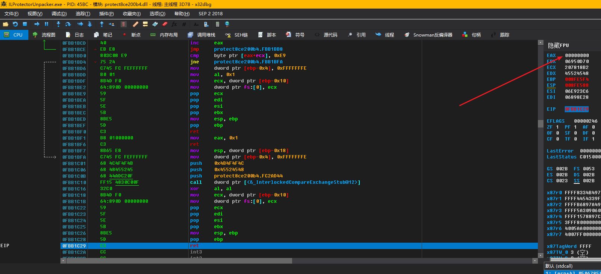

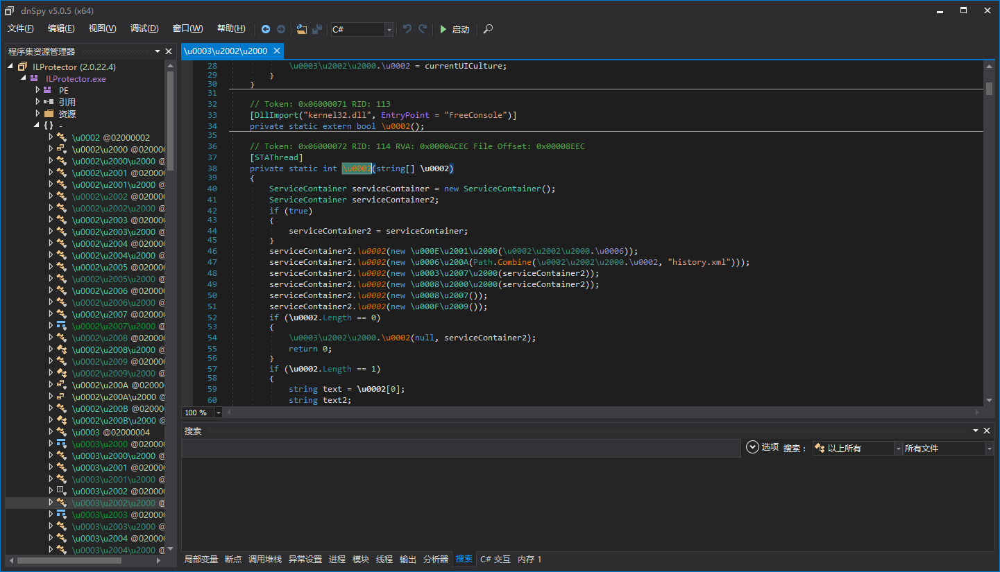

## 属于自己的脱壳机

那么对RexProg的ILProtectorUnpacker研究和对ILProtector本身的研究可以告一段落了。接下来开始讲解如何自己写一个脱壳机。

写个简单的框架：


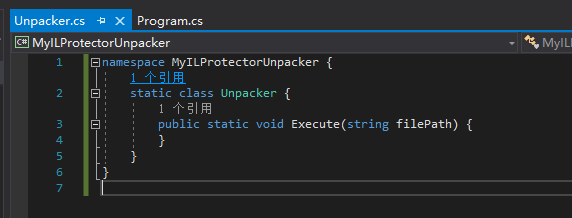
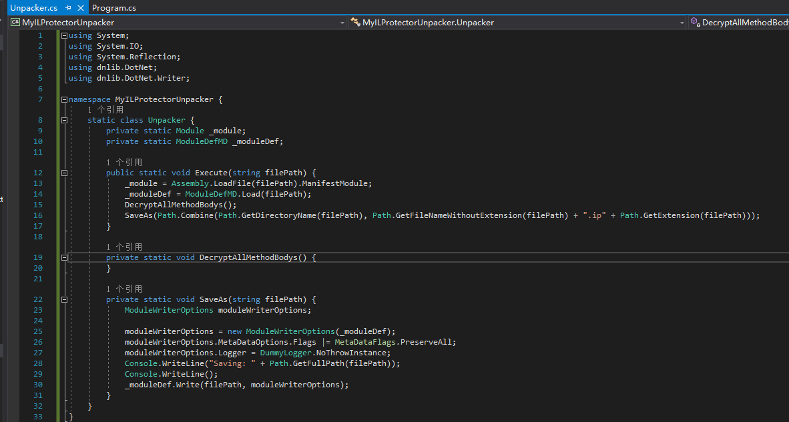

在调用DecryptAllMethodBodys之前，我们得对System.Diagnostics.StackFrameHelper.GetMethodBase进行Hook。

GetMethodBase是实例方法，所以我们专门写一个类来放Detour方法，在这个类的静态构造器里面插入反射API初始化的代码：

``` csharp
Module mscorlib;

mscorlib = typeof(object).Module;
FieldInfo_rgMethodHandle = mscorlib.GetType("System.Diagnostics.StackFrameHelper").GetField("rgMethodHandle", BindingFlags.NonPublic | BindingFlags.Instance);
ConstructorInfo_RuntimeMethodInfoStub = mscorlib.GetType("System.RuntimeMethodInfoStub").GetConstructor(BindingFlags.Public | BindingFlags.Instance, null, new Type[] { typeof(IntPtr), typeof(object) }, null);
MethodInfo_GetTypicalMethodDefinition = mscorlib.GetType("System.RuntimeMethodHandle").GetMethod("GetTypicalMethodDefinition", BindingFlags.NonPublic | BindingFlags.Static, null, new Type[] { mscorlib.GetType("System.IRuntimeMethodInfo") }, null);
MethodInfo_GetMethodBase = mscorlib.GetType("System.RuntimeType").GetMethod("GetMethodBase", BindingFlags.NonPublic | BindingFlags.Static, null, new Type[] { mscorlib.GetType("System.IRuntimeMethodInfo") }, null);
```

注意，因为是Hook了的，所以this指针是错误的，FieldInfo_rgMethodHandle这样的字段要定义为静态的字段，如果不理解，可以改成非静态，看看如何报错，这里不演示了。

相较于暴力GetMethodByName，我更喜欢用Attribute来获取自己的Detour。我们定义一个DetourAttribute：

``` csharp
private sealed class GetMethodBaseDetourAttribute : Attribute {
}
```

回到那个放Detour的类，写上这样的代码：

``` csharp
[GetMethodBaseDetour]
public virtual MethodBase GetMethodBaseDetour(int i) {
	IntPtr[] rgMethodHandle;
	IntPtr methodHandleValue;
	object runtimeMethodInfoStub;
	object typicalMethodDefinition;
	MethodBase result;

	rgMethodHandle = (IntPtr[])FieldInfo_rgMethodHandle.GetValue(this);
	methodHandleValue = rgMethodHandle[i];
	runtimeMethodInfoStub = ConstructorInfo_RuntimeMethodInfoStub.Invoke(new object[] { methodHandleValue, this });
	typicalMethodDefinition = MethodInfo_GetTypicalMethodDefinition.Invoke(null, new[] { runtimeMethodInfoStub });
	result = (MethodBase)MethodInfo_GetMethodBase.Invoke(null, new[] { typicalMethodDefinition });
	if (result.Name == "InvokeMethod")
		result = _module.ResolveMethod(_currentMethod.MDToken.ToInt32());
	return result;
}
```

这样我们就可以使用

``` csharp
private static MethodInfo GetMethodByAttribute<TClass, TMethodAttribute>() where TMethodAttribute : Attribute {
	foreach (MethodInfo methodInfo in typeof(TClass).GetMethods(BindingFlags.Public | BindingFlags.NonPublic | BindingFlags.Instance | BindingFlags.Static)) {
		object[] attributes;

		attributes = methodInfo.GetCustomAttributes(typeof(TMethodAttribute), false);
		if (attributes != null && attributes.Length != 0)
			return methodInfo;
	}
	return null;
}
```

来获取Detour，不用担心什么时候代码被混淆了，GetMethodByName会出错。

``` csharp
private static void* GetMethodAddress(MethodBase methodBase) {
	RuntimeHelpers.PrepareMethod(methodBase.MethodHandle);
	return (void*)methodBase.MethodHandle.GetFunctionPointer();
}

private static void WriteJunkCode(ref void* address) {
	byte[] junkJmp;

	junkJmp = new byte[] {
		0xEB, 0x00
	};
	// 这里使用JunkJmp，相当于jmp eip/rip+2
	Write(address, junkJmp);
	address = (byte*)address + 2;
}

private static void WriteJmp(ref void* address, void* target) {
	byte[] jmpStub;

	if (IntPtr.Size == 4) {
		jmpStub = new byte[] {
			0xE9, 0x00, 0x00, 0x00, 0x00
		};
		fixed (byte* p = jmpStub)
			*(int*)(p + 1) = (int)target - (int)address - 5;
	}
	else {
		jmpStub = new byte[] {
			0x48, 0xB8, 0x00, 0x00, 0x00, 0x00, 0x00, 0x00, 0x00, 0x00, // mov rax, target
			0xFF, 0xE0                                                  // jmp rax
		};
		fixed (byte* p = jmpStub)
			*(ulong*)(p + 2) = (ulong)target;
	}
	Write(address, jmpStub);
	address = (byte*)address + jmpStub.Length;
}
```

写上这样的方法，我们再写个新方法，获取Target的地址和Detour的地址，先对Tagret写入JunkCode，再写入真正的Jmp跳转。

此时，我们可以在Execute(string filePath)中加入：

``` csharp
if (Environment.Version.Major == 2)
	throw new NotSupportedException();
else
	InstallHook(typeof(object).Module.GetType("System.Diagnostics.StackFrameHelper").GetMethod("GetMethodBase", BindingFlags.Public | BindingFlags.Instance), GetMethodByAttribute<StackFrameHelperDetour4, GetMethodBaseDetourAttribute>());
```

接下来，我们写好先前定义的DecryptAllMethodBodys()。先在方法内定义变量

``` csharp
TypeDef globalType;
object instanceOfInvoke;
MethodInfo methodInfo_Invoke;
uint methodTableLength;
```

然后，我们要通过反射来获取&ltModule&gt中的"internal static i Invoke"

``` csharp
globalType = _moduleDef.GlobalType;
instanceOfInvoke = null;
foreach (FieldDef fieldDef in globalType.Fields)
	if (fieldDef.Name == "Invoke")
		instanceOfInvoke = _module.ResolveField(fieldDef.MDToken.ToInt32()).GetValue(null);
methodInfo_Invoke = instanceOfInvoke.GetType().GetMethod("Invoke");
methodTableLength = _moduleDef.TablesStream.MethodTable.Rows;
```

methodTableLength表示了程序集里面总共有多少个方法，我们开始遍历每一个方法，所以使用for循环来实现

``` csharp
for (uint rid = 1; rid <= methodTableLength; rid++) {
}
```

循环体内定义变量

``` csharp
MethodDef methodDef;
object dynamicMethod;
```

methodDef表示当前被Resolve的方法，dynamicMethod表示前面i.Invoke(num)返回的的值，这个值是委托，委托内部是动态方法。

``` csharp
methodDef = _moduleDef.ResolveMethod(rid);
if (!NeedDecryptMethodBody(methodDef))
	continue;
_currentMethod = methodDef;
dynamicMethod = methodInfo_Invoke.Invoke(instanceOfInvoke, new object[] { methodDef.Body.Instructions[1].GetLdcI4Value() });
```

此时，我们准备好了一切，只差Invoke与还原，所以我们再添上它们。

``` csharp
try {
	DynamicMethodBodyReader reader;

	reader = new DynamicMethodBodyReader(_moduleDef, dynamicMethod);
	reader.Read();
	_currentMethod.FreeMethodBody();
	_currentMethod.Body = reader.GetMethod().Body;
}
catch (Exception) {
}
```

我们运行下脱壳机，发现真的可以解密出方法体。如果真正跟着写了一个脱壳机，真的是非常激动的，自己又研究出了成果，不是么？

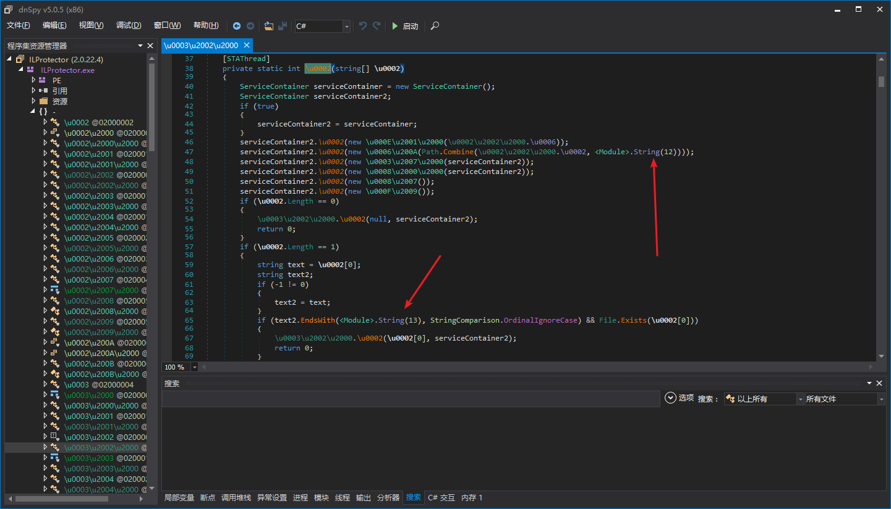

可是我们可以发现，好像还有字符串没有解密。我们再联系一下这个&ltModule&gt中的"internal static s String"，可以知道，这个和Invoke是一样的——一样的调用方式，就可以解密出字符串，这里就不继续贴代码了，因为真的是一样的，而且这个没有检测，直接调用就行。

解密出字符串的效果：


接下来，我们要移除ILProtector运行时的初始化代码。虽然不移除也没关系，但是为了完美，我们再完善一下脱壳机：

``` csharp
private static void RemoveRuntimeInitializer() {
	// IL_0000: ldtoken   '<Module>'
	// IL_0005: call      class [mscorlib]System.Type [mscorlib]System.Type::GetTypeFromHandle(valuetype [mscorlib]System.RuntimeTypeHandle)
	// IL_000A: call      native int [mscorlib]System.Runtime.InteropServices.Marshal::GetIUnknownForObject(object)
	// IL_000F: stloc     V_0
	// .try
	// {
	// 	IL_0013: call      int32 [mscorlib]System.IntPtr::get_Size()
	// 	IL_0018: ldc.i4.4
	// 	IL_0019: bne.un.s  IL_0031

	// 	IL_001B: call      class [mscorlib]System.Version [mscorlib]System.Environment::get_Version()
	// 	IL_0020: callvirt  instance int32 [mscorlib]System.Version::get_Major()
	// 	IL_0025: ldloc     V_0
	// 	IL_0029: call      bool '<Module>'::g(int32, native int)
	// 	IL_002E: pop
	// 	IL_002F: br.s      IL_004D

	// 	IL_0031: call      int32 [mscorlib]System.IntPtr::get_Size()
	// 	IL_0036: ldc.i4.8
	// 	IL_0037: bne.un.s  IL_004D

	// 	IL_0039: call      class [mscorlib]System.Version [mscorlib]System.Environment::get_Version()
	// 	IL_003E: callvirt  instance int32 [mscorlib]System.Version::get_Major()
	// 	IL_0043: ldloc     V_0
	// 	IL_0047: call      bool '<Module>'::h(int32, native int)
	// 	IL_004C: pop

	// 	IL_004D: leave.s   IL_005A
	// } // end .try
	// finally
	// {
	// 	IL_004F: ldloc     V_0
	// 	IL_0053: call      int32 [mscorlib]System.Runtime.InteropServices.Marshal::Release(native int)
	// 	IL_0058: pop
	// 	IL_0059: endfinally
	// } // end handler

	MethodDef cctor;
	IList<Instruction> instructionList;
	int startIndex;
	int endIndex;
	IList<ExceptionHandler> exceptionHandlerList;

	cctor = _moduleDef.GlobalType.FindStaticConstructor();
	instructionList = cctor.Body.Instructions;
	startIndex = 0;
	for (int i = 0; i < instructionList.Count; i++)
		if (instructionList[i].OpCode == OpCodes.Call && instructionList[i].Operand is MemberRef && ((MemberRef)instructionList[i].Operand).Name == "GetIUnknownForObject")
			startIndex = i - 2;
	endIndex = 0;
	for (int i = startIndex; i < instructionList.Count; i++)
		if (instructionList[i].OpCode == OpCodes.Call && instructionList[i].Operand is MemberRef && ((MemberRef)instructionList[i].Operand).Name == "Release")
			endIndex = i + 3;
	for (int i = startIndex; i < endIndex; i++) {
		instructionList[i].OpCode = OpCodes.Nop;
		instructionList[i].Operand = null;
	}
	exceptionHandlerList = cctor.Body.ExceptionHandlers;
	for (int i = 0; i < exceptionHandlerList.Count; i++)
		if (exceptionHandlerList[i].HandlerType == ExceptionHandlerType.Finally && exceptionHandlerList[i].HandlerEnd == instructionList[endIndex]) {
			exceptionHandlerList.RemoveAt(i);
			break;
		}
}
```

代码中startIndex表示运行时初始化代码的开头，endIndex表示运行时初始化代码的结尾的后一句代码。因为方法体中可能存在跳转，又因为dnlib的一些特性，我们不能直接把Instruction换成Nop，而要这样：

``` csharp
instructionList[i].OpCode = OpCodes.Nop;
instructionList[i].Operand = null;
```

除此之外，被保护的程序集中还有一些别的ILProtector造成的残留代码，移除方法就不一一阐述。

放出成品脱壳机没有太大的意思，还是更希望读者能自己照着文章研究出脱壳机。而不是只会使用别人写好的，哪天加壳工具一更新，脱壳机失效，就不会脱壳了。
